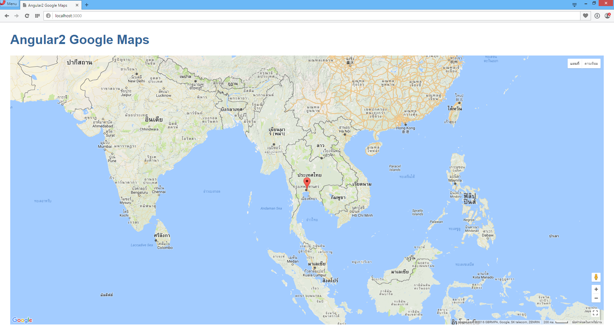

# angular2-google-maps
ANGULAR2 Application | Google Maps API v3.26

# install
- npm install concurrently lite-server typescript typings -g
- typings install
- npm install --save
- npm start
- http://localhost:3000/

# demo
